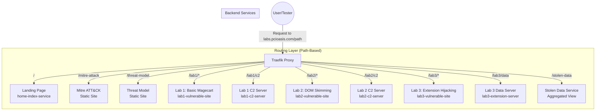

# Traefik Routing Design

## Executive Summary

This document outlines the design for implementing Traefik as a reverse proxy to unify routing across local development and production environments. The goal is to transition from port-based local routing and inconsistent production URLs to a unified, path-based routing architecture that ensures technical consistency, maintains privacy, and fits within a strict $20/month budget.

## Table of Contents

1. [Problem Statement](#problem-statement)
2. [Solution Overview](#solution-overview)
3. [Architecture Design](#architecture-design)
4. [Routing Configuration](#routing-configuration)
5. [Deployment Strategy](#deployment-strategy)
6. [Implementation Plan](#implementation-plan)
7. [Benefits](#benefits)

## Problem Statement

### Current State

**Local Development:**
- Port-based routing: `localhost:3000` (home), `localhost:9001` (lab1), `localhost:9003` (lab2), `localhost:9005` (lab3)
- Inconsistent with production URLs
- Requires remembering multiple port numbers
- Playwright tests must be configured differently for local vs production

**Production:**
- Direct Cloud Run service URLs (e.g., `https://lab-01-basic-magecart-prd-xxx.run.app`)
- Inconsistent path structure
- Services are publicly accessible, allowing provider scanning
- Risk of labs being flagged as "Dangerous" by automated scanners

### Requirements

1. **Technical Consistency**: Same path structure in local and production
2. **Security & Privacy**: Prevent provider scanning of lab content
3. **Budget Constraint**: Under $20/month
4. **Testing Consistency**: Playwright tests work identically in both environments

## Solution Overview

### Why Traefik?

Traefik Open Source provides the best balance of:
- **Technical Consistency**: Same container configuration for local and production
- **Security**: Control access and prevent provider scanning
- **Budget**: Open-source, no per-path fees
- **Flexibility**: Path-based routing with Docker labels (local) and file provider (production)

### Comparison with Alternatives

| Feature | Traefik/Nginx | Cloudflare Managed | GCP App Load Balancer |
|---------|---------------|-------------------|----------------------|
| Consistency | High (same container) | Medium (config differences) | Low (complex/different) |
| Budget | Under $20/month | High (extra fees per path) | High (base service costs) |
| Privacy | High (avoids provider scanning) | Low (provider access) | Low (provider access) |
| Routing | Path-based | Path-based (Paid) | Path-based |

## Architecture Design

### System Architecture



### Routing Paths

| Component | Path | Current Local | New Local | Production |
|-----------|------|---------------|-----------|------------|
| Landing Page | `/` | `localhost:3000` | `localhost/` | `labs.pcioasis.com/` |
| Mitre ATT&CK | `/mitre-attack` | `localhost:3000/mitre-attack` | `localhost/mitre-attack` | `labs.pcioasis.com/mitre-attack` |
| Threat Model | `/threat-model` | `localhost:3000/threat-model` | `localhost/threat-model` | `labs.pcioasis.com/threat-model` |
| Lab 1 | `/lab1/*` | `localhost:9001` | `localhost/lab1/*` | `labs.pcioasis.com/lab1/*` |
| Lab 1 C2 | `/lab1/c2` | `localhost:9002` | `localhost/lab1/c2` | `labs.pcioasis.com/lab1/c2` |
| Lab 2 | `/lab2/*` | `localhost:9003` | `localhost/lab2/*` | `labs.pcioasis.com/lab2/*` |
| Lab 2 C2 | `/lab2/c2` | `localhost:9004` | `localhost/lab2/c2` | `labs.pcioasis.com/lab2/c2` |
| Lab 3 | `/lab3/*` | `localhost:9005` | `localhost/lab3/*` | `labs.pcioasis.com/lab3/*` |
| Lab 3 Data | `/lab3/data` | `localhost:9006` | `localhost/lab3/data` | `labs.pcioasis.com/lab3/data` |
| Stolen Data | `/stolen-data` | N/A | `localhost/stolen-data` | `labs.pcioasis.com/stolen-data` |

## Routing Configuration

### Traefik Routing Rules

Traefik will use `PathPrefix` rules to route requests:

```yaml
# Example routing rules
routers:
  landing:
    rule: "PathPrefix(`/`)"
    priority: 1  # Lowest priority, catch-all
    
  mitre-attack:
    rule: "PathPrefix(`/mitre-attack`)"
    priority: 10
    
  threat-model:
    rule: "PathPrefix(`/threat-model`)"
    priority: 10
    
  lab1:
    rule: "PathPrefix(`/lab1`)"
    priority: 10
    stripPrefix: true  # Remove /lab1 prefix before forwarding
    
  lab1-c2:
    rule: "PathPrefix(`/lab1/c2`)"
    priority: 20  # Higher priority than /lab1
    
  lab2:
    rule: "PathPrefix(`/lab2`)"
    priority: 10
    stripPrefix: true
    
  lab2-c2:
    rule: "PathPrefix(`/lab2/c2`)"
    priority: 20
    
  lab3:
    rule: "PathPrefix(`/lab3`)"
    priority: 10
    stripPrefix: true
    
  lab3-data:
    rule: "PathPrefix(`/lab3/data`)"
    priority: 20
    
  stolen-data:
    rule: "PathPrefix(`/stolen-data`)"
    priority: 10
```

### Path Stripping

For lab services, Traefik will strip the path prefix before forwarding:
- Request: `labs.pcioasis.com/lab1/products.html`
- Forwarded to lab1 service: `/products.html`

This allows lab services to work without modification.

## Deployment Strategy

### Local Development (Docker Compose)

Traefik uses Docker provider with labels for automatic service discovery:

```yaml
services:
  traefik:
    image: traefik:v2.11
    container_name: traefik-proxy
    ports:
      - "80:80"
      - "8080:8080"  # Traefik dashboard
    volumes:
      - /var/run/docker.sock:/var/run/docker.sock:ro
      - ./deploy/traefik/traefik.yml:/etc/traefik/traefik.yml:ro
      - ./deploy/traefik/dynamic:/etc/traefik/dynamic:ro
    command:
      - --api.dashboard=true
      - --api.insecure=true
      - --providers.docker=true
      - --providers.docker.exposedbydefault=false
      - --entrypoints.web.address=:80
    networks:
      - labs-network

  home-index:
    # ... existing config ...
    labels:
      - "traefik.enable=true"
      - "traefik.http.routers.landing.rule=PathPrefix(`/`)"
      - "traefik.http.routers.landing.priority=1"
      - "traefik.http.services.landing.loadbalancer.server.port=8080"
      - "traefik.http.routers.mitre.rule=PathPrefix(`/mitre-attack`)"
      - "traefik.http.routers.mitre.priority=10"
      - "traefik.http.services.mitre.loadbalancer.server.port=8080"
      - "traefik.http.routers.threat-model.rule=PathPrefix(`/threat-model`)"
      - "traefik.http.routers.threat-model.priority=10"
      - "traefik.http.services.threat-model.loadbalancer.server.port=8080"

  lab1-vulnerable-site:
    # ... existing config ...
    labels:
      - "traefik.enable=true"
      - "traefik.http.routers.lab1.rule=PathPrefix(`/lab1`)"
      - "traefik.http.routers.lab1.priority=10"
      - "traefik.http.middlewares.lab1-stripprefix.stripprefix.prefixes=/lab1"
      - "traefik.http.routers.lab1.middlewares=lab1-stripprefix"
      - "traefik.http.services.lab1.loadbalancer.server.port=80"
```

### Production (Cloud Run)

Traefik runs as a Cloud Run service with file provider configuration:

1. **Traefik Service**: Primary entry point at `labs.pcioasis.com`
2. **File Provider**: Static configuration mapping paths to internal Cloud Run URLs
3. **Internal Services**: Lab services marked as internal-only (not publicly accessible)
4. **Privacy**: Only Traefik can access lab services, preventing provider scanning

```yaml
# traefik.yml (Cloud Run)
entryPoints:
  web:
    address: ":8080"

providers:
  file:
    filename: /etc/traefik/dynamic/routes.yml
    watch: true

http:
  routers:
    landing:
      rule: "PathPrefix(`/`)"
      service: home-index
      priority: 1
      
    lab1:
      rule: "PathPrefix(`/lab1`)"
      service: lab1-service
      priority: 10
      middlewares:
        - lab1-stripprefix

  services:
    home-index:
      loadBalancer:
        servers:
          - url: "https://home-index-prd-xxx.run.app"
    
    lab1-service:
      loadBalancer:
        servers:
          - url: "https://lab-01-basic-magecart-prd-xxx.run.app"

  middlewares:
    lab1-stripprefix:
      stripPrefix:
        prefixes:
          - "/lab1"
```

## Implementation Plan

### Phase 1: Local Development Setup

1. **Add Traefik to docker-compose.yml**
   - Configure Traefik service with Docker provider
   - Add labels to all existing services
   - Remove port mappings from services (Traefik handles routing)

2. **Create Traefik Configuration**
   - `deploy/traefik/traefik.yml` - Main configuration
   - `deploy/traefik/dynamic/` - Dynamic routing rules

3. **Update Service URLs**
   - Update `home-index-service` to generate correct URLs
   - Update lab services to handle path stripping

### Phase 2: Production Deployment

1. **Create Traefik Cloud Run Service**
   - Dockerfile for Traefik
   - Cloud Run service configuration
   - Terraform resources

2. **Configure File Provider**
   - Static routing configuration
   - Environment-specific service URLs

3. **Update Cloud Run Services**
   - Mark lab services as internal-only
   - Update IAM permissions
   - Update domain mappings

### Phase 3: Testing & Validation

1. **Update Playwright Tests**
   - Use path-based URLs
   - Test both local and production

2. **Update Documentation**
   - Local development guide
   - Production deployment guide
   - Testing guide

## Benefits

### Technical Consistency
- Same path structure in local and production
- Playwright tests work identically in both environments
- No port number memorization required

### Security & Privacy
- Lab services are internal-only (not publicly accessible)
- Prevents provider scanning of malicious code
- Reduces risk of "Dangerous" site flagging
- Foundation for future authentication

### Budget Alignment
- Traefik Open Source: Free
- Cloud Run costs: ~$5-10/month for Traefik service
- Total: Well under $20/month budget

### Developer Experience
- Single entry point: `localhost` or `labs.pcioasis.com`
- Clear path structure: `/lab1`, `/lab2`, `/lab3`
- Easy to add new labs or services
- Traefik dashboard for debugging (local only)

## Analogy

Think of Traefik as a concierge in a hotel lobby. Currently, visitors (users/tests) have to find specific hidden side doors (different ports and long URLs) to get to different rooms. With this plan, everyone enters through the front door (`labs.pcioasis.com`), and the concierge (Traefik) directs them to the correct room based on the name they ask for, while keeping the rest of the hotel private from outside observers.
